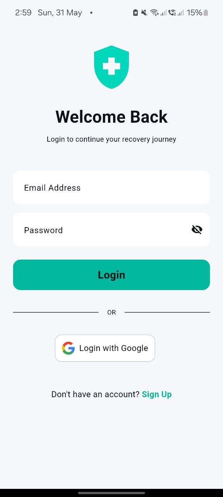
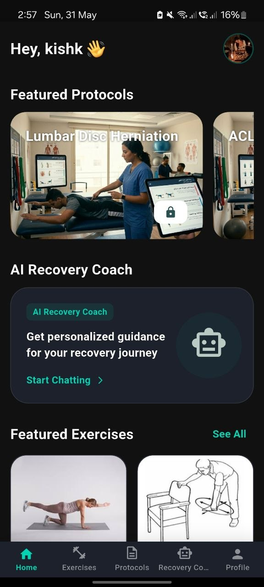
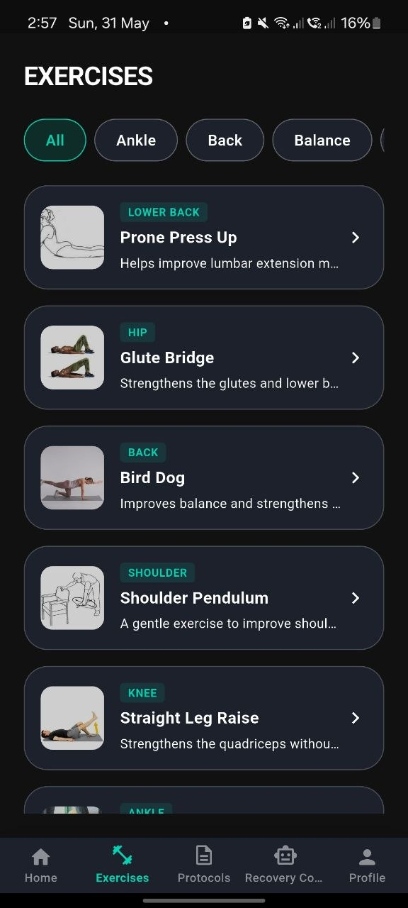
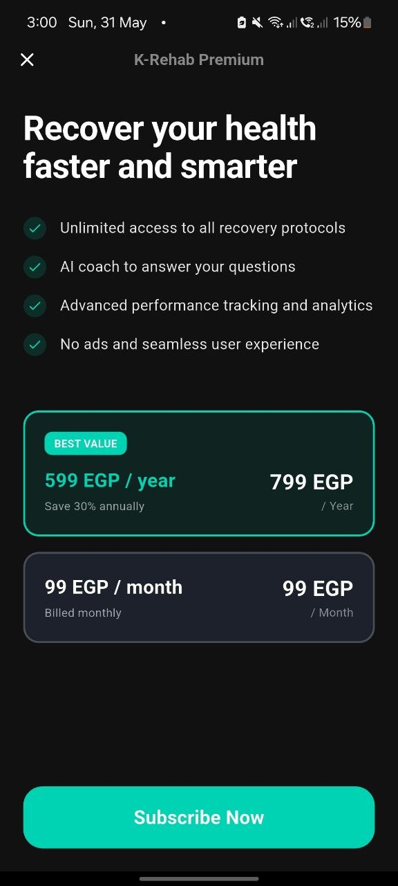
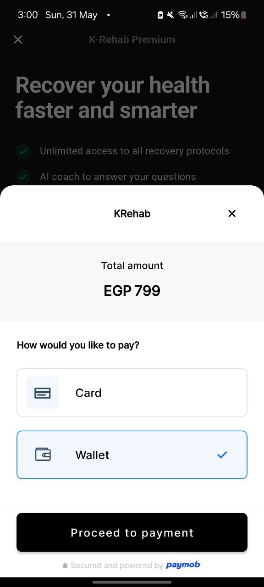
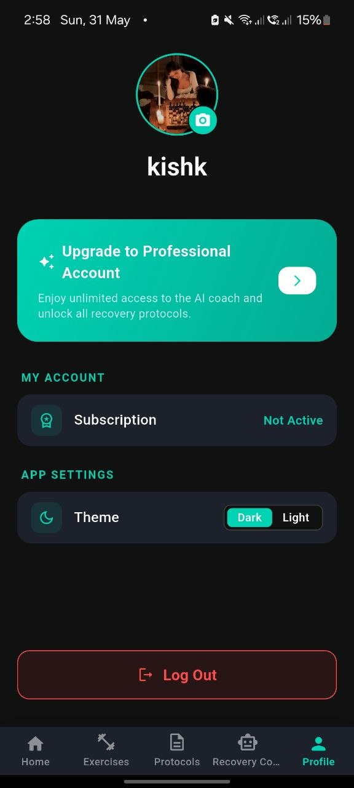
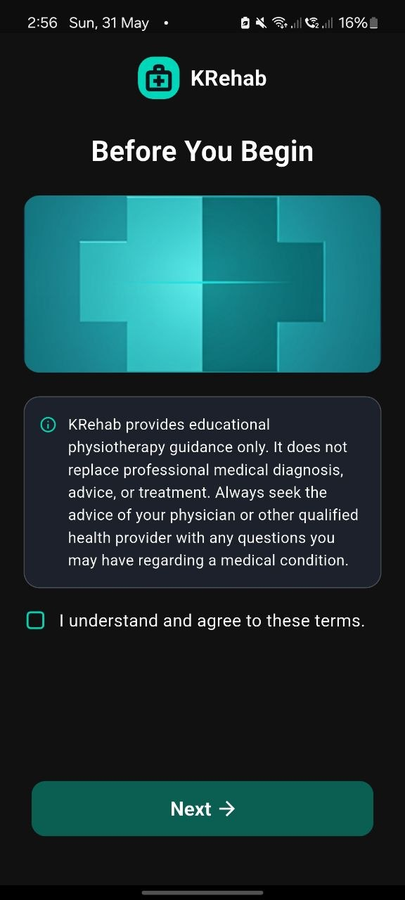

<div align="center">

# 🦴 K-Rehab

### AI-Powered Physiotherapy & Rehabilitation Platform

[](https://flutter.dev)
[](https://dart.dev)
[](https://supabase.com)
[](https://firebase.google.com)
[](https://github.com/features/actions)

> A production-ready Flutter application designed to assist physiotherapy doctors and rehabilitation specialists with structured clinical protocols, an extensive exercise database, AI-powered clinical assistance, and seamless payment integration.

</div>

---

## 📖 Project Overview

### 💡 The Problem
Physiotherapy and rehabilitation specialists manage a wide range of complex clinical cases daily. Practitioners often face challenges with:
- **Protocol Standardization**: Accessing and organizing standardized, multi-phase rehabilitation protocols for diverse joint and muscle pathologies on the go.
- **Patient Demonstrations**: Having an immediate, high-quality reference of exercise videos and precise biomechanics instructions to show or assign to patients.
- **Real-time Clinical Support**: The need for a quick, intelligent, and context-aware medical assistant to cross-reference recovery guidelines and exercise variations.

### 🚀 The Solution
**K-Rehab** is a premium mobile workspace tailored for **physiotherapists and rehabilitation doctors**. It enhances clinical workflow by providing:
1. **Clinical Protocols**: Standardized rehabilitation pathways structured by phases (e.g., Early, Mid, and Late-stage recovery).
2. **Interactive Exercise Library**: Media-rich catalog featuring step-by-step videos and detailed execution logs.
3. **AI Recovery Coach (Clinical Assistant)**: A **Gemini-powered** chatbot configured via Supabase Edge Functions to support doctors with quick answers on rehab parameters, biomechanics, and safety checks.
4. **Subscription-Based Licensing**: A paywall integrated with **Paymob** allowing clinics/doctors to subscribe and unlock premium protocol databases securely.

---

## 🎨 UI/UX Design

The application's interface was designed and prototyped using **Figma** and engineered by following the official **Google Stitch** (Material Design) UI component guidelines, ensuring a pixel-perfect, premium, and cohesive user experience across light and dark modes.

---

## 📸 Screenshots

### 1️⃣ Splash & Onboarding Flow
<div align="center">

| Splash (Light) | Splash (Dark) | Onboarding 1 | Onboarding 2 | Onboarding 3 |
| :---: | :---: | :---: | :---: | :---: |
|  |  |  |  |  |

</div>

### 2️⃣ Authentication & Main Features
<div align="center">

| Login | Sign Up | Home | Protocols |
| :---: | :---: | :---: | :---: |
|  |  |  |  |

</div>

### 3️⃣ Exercises & AI Recovery Coach
<div align="center">

| Exercise | Exercise Details | AI Assistance 1 | AI Assistance 2 |
| :---: | :---: | :---: | :---: |
|  |  |  |  |

</div>

### 4️⃣ Checkout, Payment & Settings
<div align="center">

| Paywall | Paymob Checkout | Payment Success | Profile | Disclaimer |
| :---: | :---: | :---: | :---: | :---: |
|  |  |  |  |  |

</div>

---

## ✨ Key Features

### 🤖 AI Recovery Coach
- Powered by **Gemini AI** via Supabase Edge Functions (API key never exposed client-side)
- Personalized clinical feedback and biomechanics guidance for practitioners
- Context-aware chat with session memory

### 📋 Rehabilitation Protocols
- Structured multi-phase rehab programs
- Exercise library with **video playback** (`video_player`)
- Standardized progress tracking across rehabilitation protocols

### 🏋️ Exercise Management
- Rich exercise catalog with instructions and media
- Difficulty levels and session scheduling
- Animated transitions between exercise steps

### 💳 Payment Integration (Paymob)
- Credit/debit card payments
- Mobile wallet support
- Secure key management via environment variables

### 🔐 Authentication & Security
- **Supabase Auth** with OAuth callback support
- Credentials stored with `flutter_secure_storage`
- Environment-based config (`.env`) — no secrets in source

### 🎨 Onboarding Experience
- Animated onboarding slides with `smooth_page_indicator`
- Native splash screen via `flutter_native_splash`
- Animated entrance transitions with `flutter_animate`

### 🌙 Theme System
- Light / Dark mode with `animated_theme_switcher`
- Persistent theme preference via `shared_preferences`

### 📦 Offline Support
- Local caching with **Hive** (type-safe, generated adapters)
- Cached network images with `cached_network_image`

---

## 🏗️ Architecture

This project follows **Clean Architecture** with strict separation of concerns:

```
lib/
├── core/
│   ├── config/          # App flavors & environment config
│   ├── constants/       # App-wide constants
│   ├── di/              # Dependency injection (GetIt)
│   ├── error/           # Failure classes & error handling
│   ├── router/          # GoRouter navigation
│   ├── services/        # Shared services (e.g., Supabase client)
│   ├── storage/         # Hive & secure storage abstractions
│   ├── theme/           # Theme data & tokens
│   ├── utils/           # Helpers & extensions
│   └── widgets/         # Shared reusable widgets
│
└── features/
    ├── auth/            # Login, register, session management
    ├── onboarding/      # First-launch flow
    ├── home/            # Dashboard & navigation
    ├── protocols/       # Rehab protocol listings
    ├── exercises/       # Exercise catalog & player
    ├── recoveryCoach/   # AI chat interface
    ├── payment/         # Paymob checkout flow
    └── profile/         # User profile & settings
```

Each feature follows the **data → domain → presentation** layering:
```
feature/
├── data/
│   ├── datasources/     # Supabase API calls
│   ├── models/          # JSON serialization
│   └── repositories/    # Implements domain contracts
└── presentation/
    ├── cubit/           # BLoC/Cubit state management
    ├── pages/           # Full-screen routes
    └── widgets/         # Feature-specific components
```

### State Management
- **flutter_bloc** (Cubit pattern) — one Cubit per feature
- Sealed/abstract state classes with `equatable`
- UI is pure listener — zero business logic in widgets

### Dependency Injection
- **GetIt** service locator
- All dependencies registered at startup in `core/di/`

---

## 🛠️ Tech Stack

| Layer | Technology |
|---|---|
| **Framework** | Flutter 3.x + Dart 3.x |
| **Backend** | Supabase (Auth, Database, Edge Functions) |
| **State** | flutter_bloc (Cubit) |
| **Navigation** | GoRouter |
| **DI** | GetIt |
| **AI** | Gemini via Supabase Edge Functions |
| **Payments** | Paymob |
| **Storage** | Hive + flutter_secure_storage |
| **Media** | video_player + cached_network_image |
| **Animations** | flutter_animate + lottie |
| **CI/CD** | GitHub Actions + Firebase App Distribution |

---

## 🚀 CI/CD Pipeline

This project has a fully automated two-track CI/CD pipeline using **GitHub Actions** and **Firebase App Distribution**.

```
┌─────────────────────────────────────────────────────────┐
│                    GitHub Actions                        │
│                                                         │
│   main / feature branch                                 │
│        │                                                │
│        ▼                                                │
│   ┌─────────┐    Manual trigger    ┌──────────────┐    │
│   │  🧪 Dev  │ ──────────────────▶ │ 🚀 Production │   │
│   │  Workflow│                     │   Workflow    │    │
│   └────┬────┘                     └──────┬───────┘    │
│        │                                 │             │
│    Build APK                        Build AAB          │
│    (debug-signed)               (release + obfuscated) │
│        │                                 │             │
│        ▼                                 ▼             │
│   Firebase App Distribution        Firebase App        │
│   → internal-testers group     Distribution            │
│                                 → qa-testers group     │
└─────────────────────────────────────────────────────────┘
```

### Workflow Files

| Workflow | Trigger | Output | Testers Group |
|---|---|---|---|
| [`development.yml`](.github/workflows/development.yml) | Manual (`workflow_dispatch`) | Signed APK | `internal-testers` |
| [`production.yml`](.github/workflows/production.yml) | Manual (`workflow_dispatch`) | Signed AAB + Debug Symbols | `qa-testers` |

### GitHub Secrets Required

Configure the following secrets in **Settings → Secrets → Actions**:

```
# Supabase
SUPABASE_URL
SUPABASE_ANON_KEY
AUTH_CALLBACK_URL

# Firebase
GOOGLE_SERVICES_JSON        # Full content of google-services.json
DEV_FIREBASE_APP_ID         # Firebase App ID for dev flavor
PROD_FIREBASE_APP_ID        # Firebase App ID for prod flavor
FIREBASE_TOKEN              # firebase login:ci token

# Android Signing
KEYSTORE_BASE64             # base64-encoded .jks keystore
KEYSTORE_PASSWORD
KEY_PASSWORD
KEY_ALIAS

# Paymob
PAYMOB_PUBLIC_KEY
PAYMOB_CARD_INTEGRATION_ID
PAYMOB_WALLET_INTEGRATION_ID
```

### Security Highlights
- ✅ Secrets injected at build time — **never stored in source**
- ✅ Keystore decoded from base64 at runtime
- ✅ `.env` file created dynamically in CI — not committed
- ✅ Code obfuscation (`--obfuscate`) + split debug info for Crashlytics
- ✅ Debug symbols archived as GitHub artifacts (90-day retention for prod)

### ⚡ Automation Evidence (CI/CD Showcase)
<div align="center">

| GitHub Actions Workflows | Firebase App Distribution |
| :---: | :---: |
|  |  |

</div>

---

